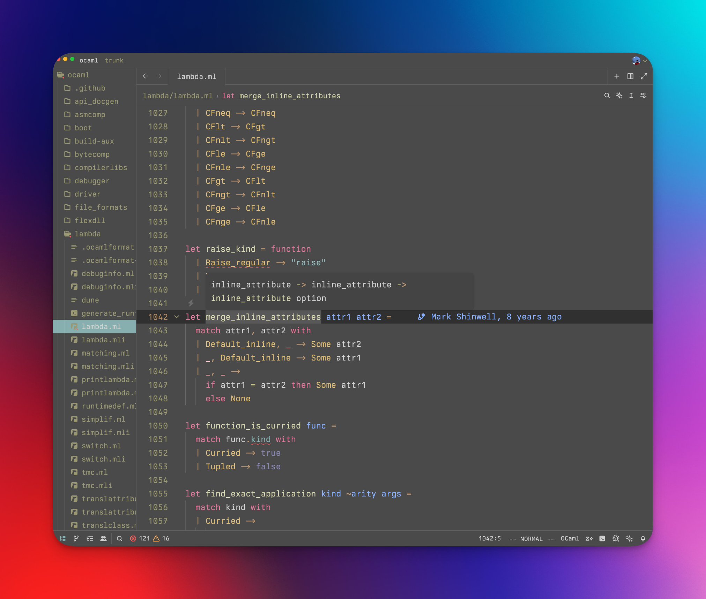
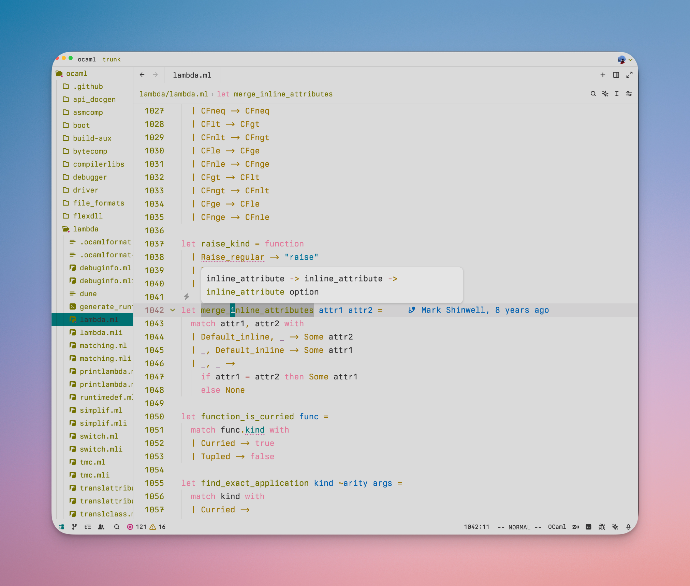

# seoul256-zed

A port of [seoul256](https://github.com/junegunn/seoul256.vim) theme to [Zed](https://zed.dev/)

### Light

# Installation

1. Open the Extensions pane with `⌘+⇧+X`
2. Search "seoul256" and install the extension
3. `⌘+k` followed by `⌘+t` to open the Theme selector
4. Enter "seoul256" to search for the theme and enable it
